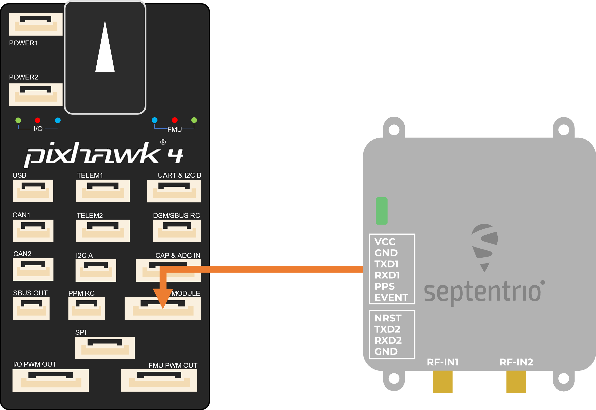
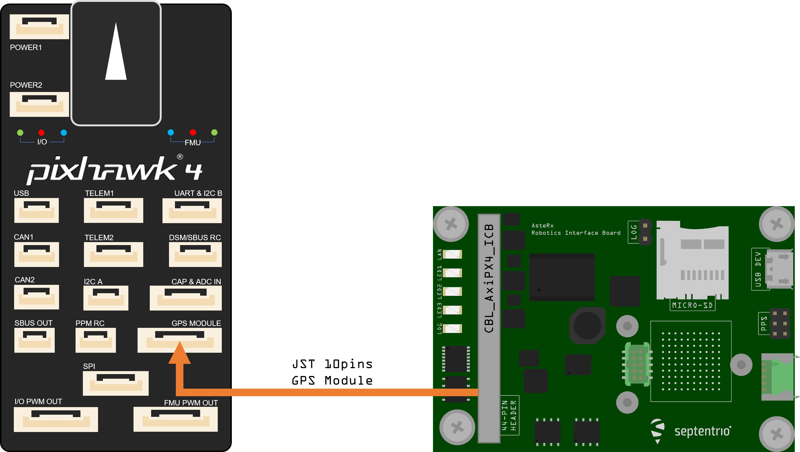

# Getting Started Guide

- [Hardware Setup](#hardware-setup)
    - [Web App](#web-app)
- [Pixhawk 4 with Septentrio Receiver Using RIB Interface](#pixhawk-4-with-septentrio-receiver-using-rib-interface)

This guide explains how to connect and configure autopilot hardware running ArduPilot to work with a
[Septentrio receiver].

## Hardware Setup

| [Pixhawk 4] & mosaic-go                         | [Pixhawk 4] & RIB Board                   |
|:-----------------------------------------------:|:-----------------------------------------:|
|  |  |

1. Power the receiver with at least 5V, using either a USB connector or power from the connection to
   the autopilot
2. Connect one or two GNSS antennas to the "RF-IN" ports on the receiver
3. Connect the receiver to the autopilot hardware like in the diagrams above
4. In the web interface or with Rx Tools, make sure the receiver's baud rate is set to 115200
   **Admin > Expert Control > Control Panel > Communication > COM Port Settings** (this is the
   default value).

**When using a mosaic-go, make sure the JST cable is wired correctly as it is not a standard cable.
Below is the wiring diagram.**

### Web App

mosaic-H GPS/GNSS receiver module with heading comes with fully documented interfaces, commands and
data messages. The included GNSS receiver control and analysis software
[RxTools](https://web.septentrio.com/l/858493/2022-04-19/xgrqp) allows receiver configuration,
monitoring as well as data logging and analysis.

The receiver includes an intuitive web user interface for easy operation and monitoring, allowing
you to control the receiver from any mobile device or computer. The web interface also uses
easy-to-read quality indicators, ideal to monitor the receiver operation during the job at hand.

## [Pixhawk 4] with [Septentrio Receiver] Using RIB Interface

The steps below detail how to integrate a [Pixhawk 4] with the latest generation [AsteRx] GNSS and
INS receivers using a Robotics Interface Board (RIB). In this example, the setup is done in a lab
environment using an AsteRx-m3 D receiver with RIB, without installing it on an actual UAS (Unmanned
Aerial System). Please note that the procedure is same for AsteRx-i3 S and AsteRx-m3 receivers (with
RIB kits).

The following are required for the integration:

- Laptop or PC running Windows with [Mission Planner] installed
- [AsteRx] GNSS OEM receiver
- [Pixhawk 4]
- Dual-frequency GNSS antenna(s)
- Adapters and cables to interface with MMCX connectors
- 2 * Micro-USB cable

The integration encompasses the following steps:

### Step 1:

Make sure the receiver is powered with at least 5V. You can use the micro USB connector or the open
ended supply (labeled "PWR & GND").

    

### Step 2:

Connect one or two GNSS antennas to the external antenna ports on the [AsteRx] Receiver board as
shown in Figure 1.

    

### Step 3:

Now connect the [AsteRx] Receiver to the GPS MODULE port on the [Pixhawk 4] as shown in Figure 2 and
Figure 3 depending on your receiver.

    

    

The cable should be wired as show in Figure 4.

    

### Step 4:

On a Windows Laptop/PC, download and install [Mission Planner] from the Ardupilot Website. The
drivers for the [Pixhawk 4] will be installed, along with the [Mission Planner] software.

### Step 5: 

#### Download the Firmware

From the [releases](https://github.com/septentrio-gnss/Septentrio-ArduPilot-Autopilot/releases) in
this repository, download the assets corresponding to your setup (usually a .apj file). (To build
the code for a specific target board, download the Source code and follow the
[instructions](https://ardupilot.org/dev/docs/building-the-code.html) in the ArduPilot
documentation).

#### Connect Autopilot to Computer

Once you have installed a ground station on your computer, connect the autopilot using the micro USB
cable.

#### Select the COM Port

If using [Mission Planner] as the GCS, select the COM port drop-down in the upper-right corner of
the window near the Connect button. Select AUTO or the specific port for your board. Set the Baud
rate to 115200 as shown. Do not hit Connect just yet.

    

#### Install Firmware

In [Mission Planner]’s SETUP | Install Firmware screen click "Load custom firmware" and select the
.apj file.

[Mission Planner] will try to detect which board you are using. It may ask you to unplug the board,
press OK, and plug it back in to detect the board type.

If all goes well, you will see a status appear on the bottom right including the words: “erase…”,
“program…”, “verify..”, and “Upload Done”. The firmware has been successfully uploaded to the board.

It usually takes a few seconds for the bootloader to exit and enter the main code after programming
or a power-up. Wait to press CONNECT until this occurs.

### Step 6:

In [Mission Planner], select the port corresponding to the [Pixhawk 4] as shown in Figure 3 and then
click connect (please note that port enumeration will be different for different connections). Make
sure the baudrate matches the one of the receiver which is 115200 baud per default.

    

### Step 7:

After successfully connecting to the [Pixhawk 4], select the "CONFIG" tab from the top and open the
Full Parameter List (highlighted on the left in Figure 4). Now search for "GPS_TYPE2" and set its
value to 10 to select SBF as incoming data format, it will select the [AsteRx] receiver as the
second GPS as shown in Figure 4.

    

Also make sure that the "SERIAL4_BAUD" parameter is set to 115 and that "SERIAL4_PROTOCOL" is
configured as value 5 for GPS as shown in Figure 5.

    

Finally, you can also switch off the Ardupilot automatic configuration by setting "GPS_AUTO_CONFIG"
to 0 as shown below.

    

#### Dual Antenna Extra Parameters

For dual antenna setup, modify the following settings in addition to the ones for a single antenna
setup:

- [EK3_SRC1_YAW](https://ardupilot.org/copter/docs/parameters.html#ek3-src1-yaw) = 2 (“GPS”) or 3 (“GPS with Compass Fallback”) if a compass(es) is also in the system
- [GPS_TYPE](https://ardupilot.org/copter/docs/parameters.html#gps-type) = 26 (SBF-Heading)

> It's possible that the SBF-Heading parameter does not show up in the ground control station.
> Entering the parameter manually will still work. This problem will be resolved in a future
> release of [Mission Planner].

After applying all the above settings click on "Write Params" (on the right hand side of the screen
in above figures) to save the settings to memory.

### Step 8:

Now the [Pixhawk 4] should be able to receive SBF data through serial COM2 port of the receiver. On
the Flight Data screen, the GPS2 status should now be displayed, along with a location indicator on
the map. In this case, the screen reports 3D Fix for GPS2 to indicate a standalone solution as shown
in Figure 9.

    

To read more about injecting RTK corrections using [Mission Planner], please go to this
[article](https://customersupport.septentrio.com/s/article/How-to-inject-RTK-Corrections-into-an-AsteRx-UAS-receiver-via-Mission-Planner).

### Step 9 (Only for Dual Antenna Setup)

The attitude (heading/pitch) can be computed from the orientation of the baseline between the main
and the aux1 GNSS antennas.

    

To enable multi-antenna attitude determination, follow the following procedure:

1. Attach two antennas to your vehicle, using cables of approximately the same length. The default
   antenna configuration is as depicted in the figure. It consists in placing the antennas aligned
   with the longitudinal axis of the vehicle, main antenna behind aux1. For best accuracy, try to
   maximize the distance between the antennas, and avoid significant height difference between the
   antenna ARPs.
2. In practice, the two antenna ARPs may not be exactly at the same height in the vehicle frame, or
   the main-aux1 baseline may not be exactly parallel or perpendicular to the longitudinal axis of
   the vehicle. This leads to offsets in the computed attitude angles. These offsets can be
   compensated for with the **setAttitudeOffset** command.

_For optimal heading results, the two antennas should be seperated by at least 30cm / 11.8 in
(ideally 50cm / 19.7in or more)_

_For additional configuration of the dual antenna setup, please refer to our [Knowledge
Base](https://support.septentrio.com/l/858493/2022-04-19/xgrqd) or the [hardware
manual](https://web.septentrio.com/l/858493/2022-04-19/xgrql)_

[Mission Planner]: https://ardupilot.org/planner/
[Pixhawk 4]: https://docs.px4.io/main/en/flight_controller/pixhawk4.html
[Septentrio receiver]: https://web.septentrio.com/GH-SSN-RX
[Septentrio Receiver]: https://web.septentrio.com/GH-SSN-RX
[AsteRx]: https://web.septentrio.com/GH-SSN-RX 